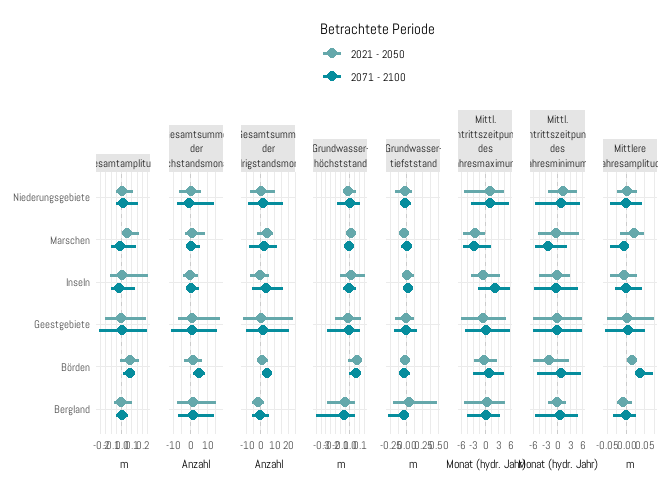
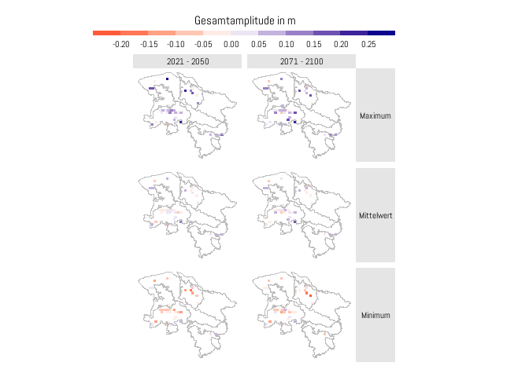

<!-- README.md is generated from README.Rmd. Please edit that file -->

# klibiwinds

<!-- badges: start -->
<!-- badges: end -->

The goal of klibiwinds is to provide the required functionality to
calculate the defined indicators in the project Klibiw7.

## Installation

You can install the development version of klibiwinds from
[GitHub](https://github.com/) with:

``` r
install.packages("devtools")
devtools::install_github("MxNl/klibiwinds")
```

## Example

This is a basic example which shows you how to use this package

First, load the package `klibiwinds`

``` r
library(klibiwinds)
library(ggplot2)
library(summarytools)
library(dplyr)
```

### Data Preparation

We use the fake data set `gwl_data_fake` included in this package to
demonstrate the following examples. If you want to apply the following
steps, you need to make sure that your dataframe has the same structure
in terms of column names, column types.

``` r
gwl_fake_data
#> # A tibble: 182,952 x 4
#>    well_id   climate_model_name date           gwl
#>    <chr>     <chr>              <date>       <dbl>
#>  1 100000926 climate_model_1    1980-01-15  0.0347
#>  2 100000926 climate_model_1    1980-02-15  0.120 
#>  3 100000926 climate_model_1    1980-03-15 -0.0307
#>  4 100000926 climate_model_1    1980-04-15 -0.211 
#>  5 100000926 climate_model_1    1980-05-15 -0.0498
#>  6 100000926 climate_model_1    1980-06-15  0.112 
#>  7 100000926 climate_model_1    1980-07-15  0.170 
#>  8 100000926 climate_model_1    1980-08-15  0.113 
#>  9 100000926 climate_model_1    1980-09-15 -0.0606
#> 10 100000926 climate_model_1    1980-10-15 -0.0502
#> # ... with 182,942 more rows
```

For a more detailed overview on the structure, see the following summary
of the dataframe

``` r
gwl_fake_data |> 
  dfSummary()
#> Data Frame Summary  
#> gwl_fake_data  
#> Dimensions: 182952 x 4  
#> Duplicates: 0  
#> 
#> -----------------------------------------------------------------------------------------------------------------------
#> No   Variable             Stats / Values            Freqs (% of Valid)       Graph                 Valid      Missing  
#> ---- -------------------- ------------------------- ------------------------ --------------------- ---------- ---------
#> 1    well_id              1. 100000926                4356 ( 2.4%)                                 182952     0        
#>      [character]          2. 100000930                4356 ( 2.4%)                                 (100.0%)   (0.0%)   
#>                           3. 100003868                4356 ( 2.4%)                                                     
#>                           4. 200000624                4356 ( 2.4%)                                                     
#>                           5. 200000628                4356 ( 2.4%)                                                     
#>                           6. 200000876                4356 ( 2.4%)                                                     
#>                           7. 200001376                4356 ( 2.4%)                                                     
#>                           8. 200001392                4356 ( 2.4%)                                                     
#>                           9. 400080191                4356 ( 2.4%)                                                     
#>                           10. 40501871                4356 ( 2.4%)                                                     
#>                           [ 32 others ]             139392 (76.2%)           IIIIIIIIIIIIIII                           
#> 
#> 2    climate_model_name   1. climate_model_1        60984 (33.3%)            IIIIII                182952     0        
#>      [character]          2. climate_model_2        60984 (33.3%)            IIIIII                (100.0%)   (0.0%)   
#>                           3. observed               60984 (33.3%)            IIIIII                                    
#> 
#> 3    date                 min : 1980-01-15          1452 distinct values     : : : : : : : : : :   182952     0        
#>      [Date]               med : 2040-06-30                                   : : : : : : : : : :   (100.0%)   (0.0%)   
#>                           max : 2100-12-15                                   : : : : : : : : : :                       
#>                           range : 120y 11m 0d                                : : : : : : : : : :                       
#>                                                                              : : : : : : : : : :                       
#> 
#> 4    gwl                  Mean (sd) : 62.5 (36.4)   182952 distinct values   : . : . : : . : . :   182952     0        
#>      [numeric]            min < med < max:                                   : : : : : : : : : :   (100.0%)   (0.0%)   
#>                           -0.4 < 62.5 < 125.4                                : : : : : : : : : :                       
#>                           IQR (CV) : 63 (0.6)                                : : : : : : : : : :                       
#>                                                                              : : : : : : : : : :                       
#> -----------------------------------------------------------------------------------------------------------------------
```

This fake data set also shows the structure, that you need to bring your
data into:

-   one column with the name `well_id` containing an identifier for the
    observation well
-   one column with the name `climate_model_name` containing an
    identifier for the climate model. Note: observed data has the value
    “observed” in this column
-   one column with the name `date` containing the dates
-   one column with the name `gwl` containing the groundwater levels

**Note: This dataframe is the only basis for the following processing
steps. So before you continue here with your own data, make sure that
your dataframe is brought into the same shape and structure!**

Now, we transform the dates in order to use the water year calendar with
`use_water_year()`. Then, we add a column containing the reference
period for each corresponding year by using the function
`add_reference_period_column()`. This function also drops all rows that
don’t belong to reference period as they are not used in the following
steps. Lastly, we filter remove time series that don’t fulfill the
criterion regarding the completeness of the reference period Z1 with
`filter_criterion_incomplete_z1_period()`.

``` r
gwl_with_ref_periods <- gwl_fake_data |>
  use_water_year() |>
  add_reference_period_column() |>
  filter_criterion_incomplete_z1_period()
```

### Calculation of Indicators

Then, we can reduce this dataframe to a dataframe where we have a
distinct combination of the columns `well_id`, `climate_model_name` and
`reference_period` using the function `make_summary_table()`

``` r
indicators_summary <- gwl_with_ref_periods |>
  make_summary_table()
```

This is the resulting table

``` r
indicators_summary
#> # A tibble: 294 x 3
#>    well_id   climate_model_name reference_period
#>    <chr>     <chr>              <chr>           
#>  1 100000926 climate_model_1    Z1              
#>  2 100000926 climate_model_1    Z2              
#>  3 100000926 climate_model_1    Z3              
#>  4 100000926 climate_model_2    Z1              
#>  5 100000926 climate_model_2    Z2              
#>  6 100000926 climate_model_2    Z3              
#>  7 100000926 observed           Z1              
#>  8 100000930 climate_model_1    Z1              
#>  9 100000930 climate_model_1    Z2              
#> 10 100000930 climate_model_1    Z3              
#> # ... with 284 more rows
```

Each well and climate model should now have 3 rows, one for each of the
three periods (Z1, Z2, Z3). The value “observed”only corresponds to the
period Z1.

Then, the final step is to calculate the indicators using the function
`add_indicators_all()`

``` r
indicators_summary <- indicators_summary |> 
  add_indicators_all(gwl_with_ref_periods)
```

Again, we can view the result

``` r
indicators_summary
#> # A tibble: 294 x 18
#>    well_id   climate_m~1 refer~2 indic~3 indic~4 indic~5 indic~6 indic~7 indic~8
#>    <chr>     <chr>       <chr>     <dbl>   <dbl>   <dbl>   <dbl>   <dbl>   <dbl>
#>  1 100000926 climate_mo~ Z1       -0.280   0.315 0.00350   0.119  -0.180   0.201
#>  2 100000926 climate_mo~ Z2       -0.359   0.285 0.00309   0.115  -0.202   0.183
#>  3 100000926 climate_mo~ Z3       -0.279   0.269 0.00188   0.114  -0.185   0.173
#>  4 100000926 climate_mo~ Z1        0.713   1.40  1.00      0.121   0.800   1.19 
#>  5 100000926 climate_mo~ Z2        0.627   1.32  0.998     0.117   0.801   1.18 
#>  6 100000926 climate_mo~ Z3        0.597   1.30  1.00      0.123   0.790   1.21 
#>  7 100000926 observed    Z1        1.72    2.38  2.01      0.116   1.81    2.19 
#>  8 100000930 climate_mo~ Z1        2.69    3.26  3.00      0.116   2.81    3.18 
#>  9 100000930 climate_mo~ Z2        2.68    3.34  3.01      0.118   2.81    3.20 
#> 10 100000930 climate_mo~ Z3        2.63    3.31  3.01      0.126   2.79    3.22 
#> # ... with 284 more rows, 9 more variables: indicator_17 <dbl>,
#> #   indicator_18 <dbl>, indicator_21 <int>, indicator_22 <int>,
#> #   indicator_23 <int>, indicator_24 <int>, indicator_31 <dbl>,
#> #   indicator_32 <dbl>, indicator_33 <list>, and abbreviated variable names
#> #   1: climate_model_name, 2: reference_period, 3: indicator_11,
#> #   4: indicator_12, 5: indicator_13, 6: indicator_14, 7: indicator_15,
#> #   8: indicator_16
```

This dataframe contains a list column with nested dataframes for the
indicator 3.3 because this indicator comprises multiple values. this
column can be unnested using the function `unnest_indicator_3_3()`

``` r
indicators_summary <- indicators_summary |> 
  unnest_indicator_3_3()
```

### Calulation of Changes

First, we split the table into projections and observations

``` r
indicators_summary_observed <- indicators_summary |>
  split_observed()
indicators_summary_projections <- indicators_summary |>
  split_projections()
```

Then, we calculate the relative changes from Z1 to Z2 and Z1 to Z3 with
`make_projections_change_table()`.

``` r
projections_change_table <-
  indicators_summary_projections |>
    make_projections_change_table()
```

Based on the relative changes stored in `projections_change_table`, we
can now calculate the absolute changes and absolute values for Z2 and Z3
with `make_observed_change_table()`

``` r
observed_change_table <-
  indicators_summary_observed |>
    make_observed_change_table(projections_change_table)
```

### Visualization of Results

Font settings

``` r
sysfonts::font_add_google("Abel", "base_font")
showtext::showtext_auto()
```

#### Distributions of Indicators

We first add indicator names with `add_indicator_names()`, filter for
core indicators with `use_core_indicators_only()` and add geological
context for grouping and analysis with `add_geo_context()`. Here you
need to provide the filepath to the Shapefile that holds the contextual
data for the observation wells. In this case, the Shape file is located
in the subfolder `data_export` of the project directory.

``` r
plot_data <- observed_change_table |>
  add_indicator_names() |>
  use_core_indicators_only() |>
  add_geo_context(here::here("data_export", "klibiw7_gwmst_raumzuordnung.shp"))
```

Now we can start plotting.

1.  Distribution grouped by Naturräume

``` r
plot_data |>
  make_plot_distribution_vs(region_natur, indicator_name)
```

 2.
Distribution grouped by Klimaräume

``` r
plot_data |>
  make_plot_distribution_vs(region_climate, indicator_name)
```

 3.
Distribution grouped by depth of screen top

``` r
plot_data |>
  make_plot_distribution_vs(screen_top, indicator_name)
```

 4.
Distribution grouped by depth to groundwater level

``` r
plot_data |>
  make_plot_distribution_vs(depth_to_gwl, indicator_name)
```

 5.
Distribution grouped by climate model

``` r
plot_data |>
  make_plot_distribution_vs(climate_model_name, indicator_name)
```


#### Heatmaps of timeseries

Analogous to the distribution plots, we first add indicator names with
`add_indicator_names()`, filter for core indicators with
`use_core_indicators_only()` and add geological context for grouping and
analysis with `add_geo_context()`

``` r
plot_data <- gwl_fake_data |>
  add_reference_period_column() |>
  filter_criterion_incomplete_z1_period() |>
  add_geo_context(here::here("data_export", "klibiw7_gwmst_raumzuordnung.shp"))
```

Now we can start plotting.

1.  Heatmaps grouped by Naturräume

``` r
plot_data |>
  make_plot_timeseries_heatmap(region_natur)
```

 2.
Heatmaps grouped by Klimaräume

``` r
plot_data |>
  make_plot_timeseries_heatmap(region_climate)
```

 3.
Heatmaps grouped by depth of screen top

``` r
plot_data |>
  make_plot_timeseries_heatmap(screen_top)
```

 4.
Heatmaps grouped by depth to groundwater level

``` r
plot_data |>
  make_plot_timeseries_heatmap(depth_to_gwl)
```


